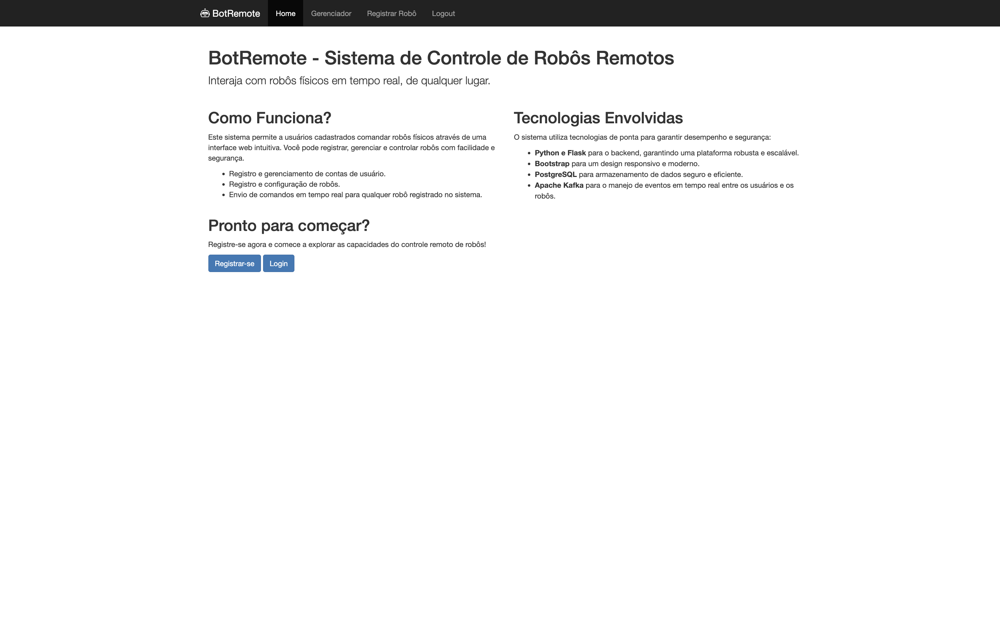
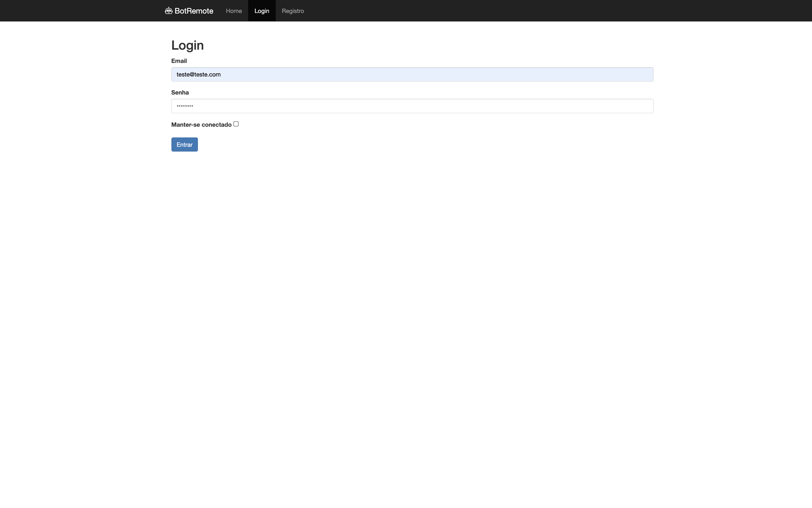
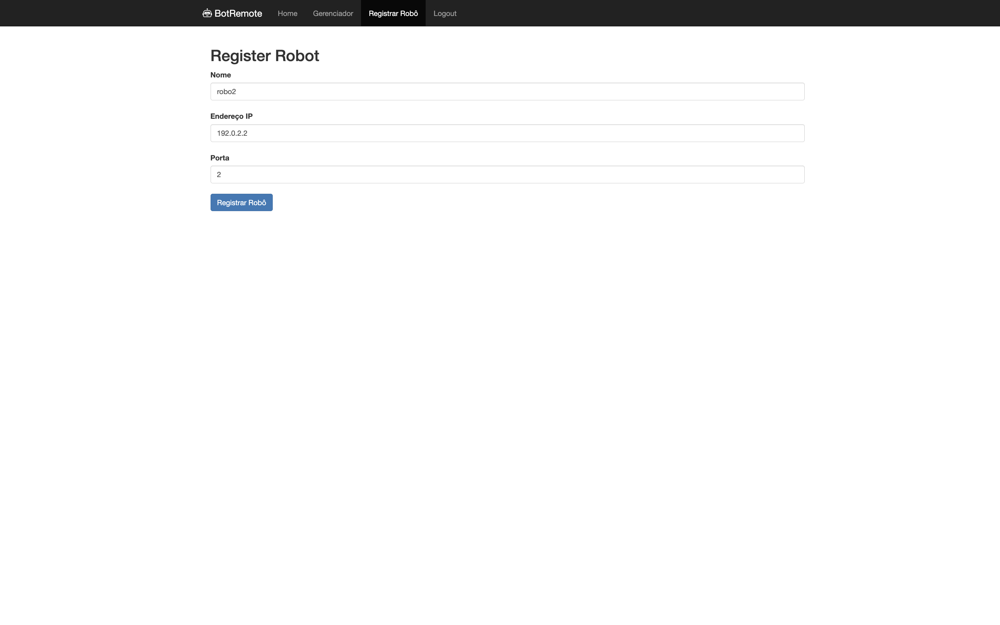
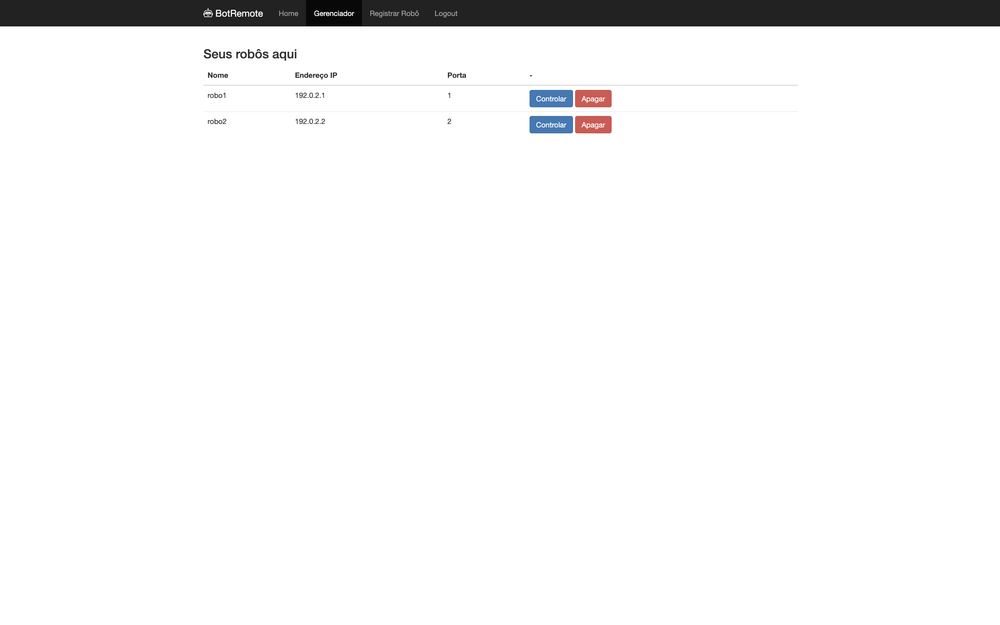

### gcloudgrad07 - Repositório do Grupo07


# BotRemote - Sistema de Controle de Robôs Remotos

## Descrição do Projeto

Este projeto permite que usuários interajam com robôs físicos remotamente através de uma interface web. O sistema é projetado para registrar, gerenciar e controlar robôs, proporcionando uma interface intuitiva para operações.


## Funcionalidades

- **Registro de usuários**: Permite que usuários se cadastrem no sistema.
- **Autenticação de usuários**: Suporta login e gerenciamento de sessões.
- **Registro e gerenciamento de robôs**: Usuários podem registrar e gerenciar robôs.
- **Controle remoto dos robôs**: Interface para enviar comandos e controlar os robôs à distância.

## Tecnologias Utilizadas

- **Frontend**: Bootstrap para estilização.
- **Backend**: Python Flask, SQLAlchemy para comunicação com o banco de dados, e wtf-forms para trabalhar com os formulários.
- **Banco de dados**: PostgreSQL.
- **Comunicação**: Utilização de WebSockets/Ajax e possível comunicação criptográfica.

## Configuração e Execução

### Pré-requisitos

- Docker e Docker Compose instalados.
- Python 3.8 ou superior.

### Instruções de Instalação

1. **Clone o Repositório**

   ```bash
   git clone https://github.com/ICMC-SSC0158-2024/gcloudgrad07
   ```

2. **Construção e Execução com Docker Compose**
   Para construir e iniciar todos os serviços definidos no `docker-compose.yml`:

   ```bash
   docker-compose up --build
   ```

   Este comando construirá as imagens Docker necessárias e iniciará os containers. O parâmetro `--build` garante que as imagens sejam reconstruídas, incorporando qualquer atualização nos Dockerfiles ou dependências.

3. **Instalação Manual (Alternativa sem Docker)**
   Se preferir rodar o projeto diretamente em seu ambiente local (não recomendado para produção). 
   Primeiramente cria um base de dados na ferramenta PostgreSQL conforme o conteúdo do arquivo `gcloudgrad07/setup/database/table.sql`

   Logo em seguida, execute:
   ```bash
   pip install -r requirements.txt
   ```
   ```bash
   cd robotremote
   ```
   ```bash
   python run.py
   ```


### Configurações no ESP32
1. No arquivo ./esp32/esp32_consumer.io, faça as seguintes alterações:
   Substitua `NETID` e `NETPASSWORD` pelo SSID da sua rede wifi e pela senha de acesso da rede, respectivamente.

   Por padrão, o servidor MQTT está apontando para `andromeda.lasdpc.icmc.usp.br`. Porém, caso esteja rodando o projeto localmente,
   substitua esse valor pelo ip interno da sua máquina, na variável `mqtt_server`. Substitua a `mqtt_port` pela porta do servidor MQTT local.

2. Certifique-se de que as seguintes bibliotecas estejam instaladas corretamende no ArduinoIDE:

   `ArduinoJson` de Benoit Blanchon

   `PubSubClient` de Nick O'Leary

3. Faça o upload do código para o ESP32. Pode ser necessário segurar o botão `boot` durante o upload.

### Acessando a Aplicação

#### Rodando a aplicação em localhost
Aplicação Web: http://localhost:5057/

Confluent Control Center: http://localhost:7057

#### Acessando a aplicação no domínio do ICMC
Aplicação Web: http://andromeda.lasdpc.icmc.usp.br:5057/

Confluent Control Center: http://andromeda.lasdpc.icmc.usp.br:7057/

## Overview da aplicação
#### Página inicial 

#### Login do usuário

#### Registrar um novo robô

#### Gerenciar os robôs registrados



## Membros do Grupo

- Leonardo Gonçalves Chahud
- Lucas Caetano Procópio
- Gustavo Antonio Perin
- Marcio Hideo Ishikawa
